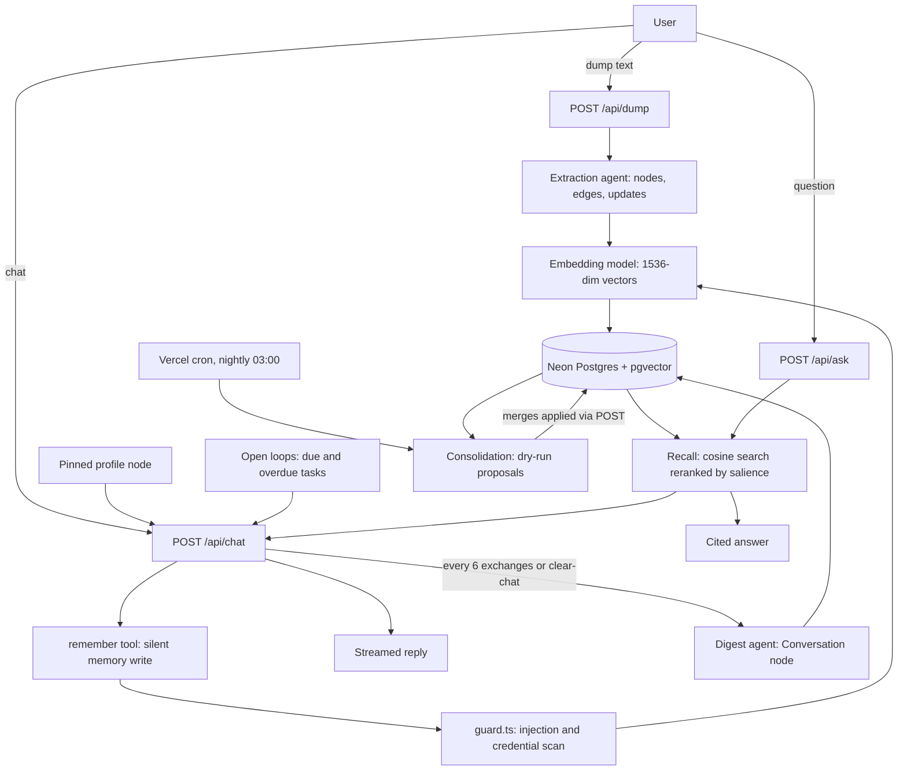

# Sanctum

An agentic second brain that grows with you. Dump anything and an extraction agent builds a linked memory graph automatically, then chat with an assistant that knows you better after every conversation.

## Contents

- [What it does](#what-it-does)
- [The pipeline](#the-pipeline)
- [Grows with you](#grows-with-you)
- [Authentication](#authentication)
- [Stack](#stack)
- [Project structure](#project-structure)
- [Getting started](#getting-started)
- [Environment variables](#environment-variables)
- [API reference](#api-reference)
- [Database and migrations](#database-and-migrations)
- [Smoke tests](#smoke-tests)
- [Deployment](#deployment)

## What it does

Sanctum turns raw text and conversations into a persistent, queryable memory graph.

- **Dump**: paste anything (notes, facts, plans, rants). An extraction agent reads it and writes typed nodes and edges into Postgres.
- **Chat**: a streaming assistant recalls relevant memories, tracks open loops, and silently saves new facts while it replies.
- **Ask**: direct questions get cited answers drawn only from your own memory graph.
- **Watch it grow**: the interface renders the graph as a full-screen cosmos behind a floating glass chat panel, so every conversation visibly becomes memory.

## The pipeline

Everything in Sanctum is one loop: text comes in, memory is written, memory shapes the reply, and the graph maintains itself while you sleep.

### Write path: text becomes memory

1. Input arrives either as a dump (`POST /api/dump`) or as chat (`POST /api/chat`).
2. The extraction agent (the chat model, guided by `brain/extract.md` and the `brain/types.md` registry) converts raw text into JSON: nodes, edges, and updates. It receives the list of existing node names, so it reuses canonical names instead of minting duplicates, links every new node to something already known, and never creates more than 3 new nodes per dump. Detail lives inside nodes as attrs; structure lives between nodes as edges.
3. Corrections are first-class: an `updates` entry can merge attrs, rename a node, or close edges that stopped being true. Forgetting is destructive, so it only happens on an explicit user request.
4. During chat, the same write happens silently through the `remember` tool while the reply streams. A trivial-prompt gate (`TRIVIAL_PROMPT_RE`) skips small talk, and `lib/guard.ts` scans memory-bound content for prompt injection and credentials before it is stored.
5. New nodes are embedded with the embedding model (1536 dims) and written to `nodes` and `edges` via Prisma, with raw SQL for the vector columns. When extraction re-encounters an entity, its `mention_count` goes up.

### Read path: replies are grounded in your life

1. A chat request assembles three kinds of context: the pinned profile node (always present), open loops (tasks due or overdue), and recalled memories.
2. Recall embeds the latest message, runs cosine similarity over pgvector, then reranks by salience so often-used memories float up and neglected ones sink.
3. The chat model streams the reply. Memories actually used get `recall_used_count` and `last_recalled_at` bumped, which feeds back into salience.
4. Every message persists to `chat_messages` under the current session, so a refresh rehydrates the thread through `/api/chat/history` and the client only ever sends the new message.
5. `POST /api/ask` reuses the same recall but answers strictly from graph context, citing which memory each fact came from.

### Sleep path: the graph maintains itself

1. Every 6 exchanges (12 persisted messages, counted from the database) and on clear-chat, the digest agent condenses the finished conversation into a Conversation digest node linked to the memories it touched. The session then rotates.
2. Nightly, a Vercel cron calls `/api/admin/consolidate` as a dry run: the consolidation agent reviews the profile, embedding-similar duplicate candidates, and thumbs-down feedback, then proposes profile promotions and merges. Nothing is applied automatically; `POST {"apply": true}` applies the merges, so a bad auto-merge can never mangle history.
3. `GET /api/recap` surfaces what Sanctum learned this week, `/api/admin/export` downloads the whole brain as JSON, and `/api/admin/rebuild` re-extracts every dump from scratch (dumps are the source of truth; the graph is a derived view).

### Safety and reliability

- `lib/guard.ts`: remembered content is later injected into the system prompt as authoritative context, so a stored injection would be a persistent jailbreak and a stored credential a lasting leak. Anything destined for long-term memory is scanned first.
- `lib/ai.ts`: every model call runs through `withRetry`, jittered exponential backoff that honors the server's Retry-After header on 429, 408, and 5xx responses. Permanent 4xx errors throw at once.
- `scripts/test-repair.mjs` mirrors `repairToolArguments`, which fixes malformed tool-call JSON from the model before it is parsed.

## Grows with you

Five feedback loops make every chat improve the next:

1. **Profile**: a pinned node for you, always in context (the sun of the cosmos). Preferences, habits, and style feedback accrue as flat dot-key attrs (`style.length`, `habit.running`) and silently shape every reply.
2. **Salience**: memories strengthen when used (mention and recall counts) and sink when neglected. Recall reranks cosine similarity by salience.
3. **Consolidation**: the sleep cycle described above. Repeated patterns get promoted into your profile; duplicates get merged on approval.
4. **Continuity**: server-side chat history, digest nodes, and open loops with natural callbacks.
5. **Feedback**: thumbs up/down on replies feeds consolidation, which infers the style correction you did not spell out.

## Authentication

Every page and API route requires a session. Auth is handled by better-auth on the same Neon Postgres: no external provider, and the `user`, `session`, `account`, and `verification` tables live next to the brain (created by `db/migrations/007_auth.sql`).

- **Sign up** at `/signup` (name, email, password). The first account ever created is always the admin.
- **Sign in** at `/login`; sign out from the account bubble in the chat header.
- **Admin switch**: the account bubble (visible to the admin) contains "Allow new sign-ups". Off means `/signup` shows a closed notice and the API rejects new accounts with 403. The flag lives in `app_state['signup_enabled']` and defaults to enabled. A completely empty user table can always sign up, so the first account can never lock itself out.
- The gate is two layers. `proxy.ts` (the Next.js 16 proxy, formerly middleware) does an optimistic session-cookie check and redirects pages to `/login` or 401s API calls. Every API route then re-verifies the session server-side with `requireUser()`, so an expired cookie cannot sneak through. Admin routes (`/api/admin/rebuild`, `/api/admin/export`) use `requireAdmin()`; `/api/admin/consolidate` stays guarded by `CRON_SECRET` for Vercel cron.
- better-auth enforces an Origin check on auth POSTs, so set `BETTER_AUTH_URL` to the deployed origin.

## Stack

- Next.js 16 (App Router, UI plus API routes), React 19, TypeScript.
- Tailwind CSS and Ant Design 5 for the interface; react-force-graph-2d for the memory cosmos.
- Authentication: better-auth with email and password, database sessions in Neon, Prisma adapter. First account is the admin; signups can be closed from the account menu.
- Prisma ORM as the typed client for all queries. DDL stays SQL-owned (`db/migrations/*.sql`, auto-applied on dev start) because Prisma cannot manage pgvector column types; embeddings are written via raw SQL. After schema changes, mirror them in `prisma/schema.prisma` and run `npx prisma generate`.
- Neon Postgres with pgvector: the memory graph (`dumps`, `nodes`, `edges`) plus semantic search over 1536-dimension embeddings (pgvector HNSW caps at 2000 dims).
- Azure Foundry (OpenAI-compatible): one endpoint and one key serve both models. The chat/extraction model (default `FW-Kimi-K3`) and the embedding model (default `text-embedding-3-large`, 1536 dims) are read from the `AZURE_FOUNDRY_CHAT_MODEL` and `AZURE_FOUNDRY_EMBED_MODEL` env vars, so deployments can be swapped without a code change.
- The brain is markdown: agent behavior lives in `brain/*.md` and is editable without redeploys.

## Project structure

~~~text
app/                    Next.js App Router: page, layout, global CSS
  login/ signup/        Auth pages (cosmos glass, standalone routes)
  api/                  API routes (see the API reference below)
brain/                  Markdown skill files: the agent's behavior, editable live
  chat.md               Chat persona and remember-tool rules
  extract.md            Extraction rules: canonical naming, linking, granularity, updates, forgetting
  types.md              Living node and edge type registry
  answer.md             Cited-answering rules
  digest.md             Conversation-to-digest condensation
  consolidate.md        Sleep-cycle review: profile promotion, merge judgment, insight
components/             Chat.tsx, GraphView.tsx (the cosmos), UserMenu.tsx (account + signup switch), AskBox.tsx, DumpBox.tsx, Providers.tsx
db/migrations/          SQL migrations, auto-applied on dev start, tracked in a _migrations table
lib/
  agent.ts              Agent orchestration: chat, extraction, ask, consolidation
  graph.ts              Graph operations: recall, salience, digests, tasks, recap
  ai.ts                 Azure Foundry client, env-based model names, withRetry backoff
  auth.ts               better-auth config, signup policy hook, requireUser/requireAdmin
  auth-client.ts        Client auth (signUp/signIn/signOut/useSession)
  guard.ts              Content scan for memory-bound text (injection and secrets)
  db.ts                 Prisma client
proxy.ts                The gate: optimistic session-cookie check, redirects to /login
prisma/schema.prisma    Typed mirror of the SQL schema (embedding columns are Unsupported, raw SQL only)
scripts/                migrate.mjs plus smoke tests (test-auth, test-growth, test-memory-scan, test-repair, test-trivial-gate)
~~~

## Getting started

Prerequisites: Node.js 20.9 or later (required by Next.js 16), a Neon Postgres database with the pgvector extension, and an Azure Foundry endpoint with chat and embedding deployments.

~~~bash
npm install              # postinstall runs prisma generate
copy .env.example .env   # fill in the values below
npm run dev              # applies any new db/migrations/*.sql, then starts Next.js
~~~

Open http://localhost:3000. You are redirected to `/login`; create the first account at `/signup` and it becomes the admin. The memory cosmos then renders behind the chat panel. The two model variables ship with working defaults in `.env.example`; change them only if your Azure deployments have different names.

## Environment variables

| Variable | Required | Purpose |
| --- | --- | --- |
| `AZURE_FOUNDRY_ENDPOINT` | yes | OpenAI-compatible base URL of the Azure Foundry resource |
| `AZURE_FOUNDRY_API_KEY` | yes | One key serves both chat and embeddings |
| `AZURE_FOUNDRY_CHAT_MODEL` | no | Chat and extraction model deployment. Default: `FW-Kimi-K3` |
| `AZURE_FOUNDRY_EMBED_MODEL` | no | Embedding model deployment. Default: `text-embedding-3-large` (1536 dims) |
| `DATABASE_URL` | yes | Neon Postgres connection string. For serverless deploys use the pooler host so short-lived functions share connections; the direct host exhausts free-tier connection limits fast |
| `CRON_SECRET` | production | Vercel sends it as `Authorization: Bearer <CRON_SECRET>` when calling the consolidation endpoint. Leave empty in local dev and the endpoint stays open |
| `BETTER_AUTH_SECRET` | production | Session signing secret (32+ chars). Generate with `node -e "console.log(require('crypto').randomBytes(32).toString('hex'))"` |
| `BETTER_AUTH_URL` | production | Base URL of the app, for example `https://your-app.vercel.app`. Auth POSTs are origin-checked against it |

## API reference

All routes require a signed-in session except `/api/auth/*`, `GET /api/settings`, and `/api/admin/consolidate` (cron-secret). Admin routes additionally require the admin flag.

| Route | Methods | What it does |
| --- | --- | --- |
| `/api/auth/*` | GET, POST | better-auth endpoints: email sign-up and sign-in, sign-out, session lookup |
| `/api/settings` | GET, POST | GET is public: `{ signupEnabled }`. POST flips the signup switch, admin only |
| `/api/chat` | POST | Streamed chat with profile, open loops, salience-ranked recall, and silent memory writes |
| `/api/chat/history` | GET | Rehydrate the current session's thread and title on page load |
| `/api/dump` | POST | Extract nodes, edges, and updates from raw text into the graph |
| `/api/ask` | POST | Cited answers from graph context only |
| `/api/graph` | GET | Full graph snapshot for the cosmos view; `?as_of=YYYY-MM-DD` returns the graph as it was at the end of that day |
| `/api/graph/node` | GET, POST | Node inspector payload; POST `{ "id", "action": "forget" }` for explicit forget |
| `/api/tasks` | GET, POST | Task nodes as an actionable list (open first, overdue flagged); POST `{ "id", "done" }` toggles status |
| `/api/recap` | GET | What Sanctum learned this week: growth made visible |
| `/api/feedback` | POST | Thumbs up/down on a reply; consolidation reads these to correct itself |
| `/api/conversations/digest` | POST | Session-end crystallization from the server-side transcript, then rotation to a fresh session |
| `/api/admin/rebuild` | POST | Wipe nodes and edges, then re-extract every dump in order. Dumps are the source of truth; the graph is a derived view |
| `/api/admin/consolidate` | GET, POST | Sleep cycle. GET (cron) and plain POST are dry runs; POST `{ "apply": true }` also applies merges |
| `/api/admin/export` | GET | Full backup of the brain as one JSON file: dumps, nodes (embeddings excluded), edges, feedback, chat messages |

## Database and migrations

Schema lives in `db/migrations/` as plain SQL, auto-applied on `npm run dev` and tracked in a `_migrations` table.

- To change the schema, add a new `00X_your_change.sql` file. It runs on the next dev start. Never edit an already-applied file.
- `npm run build` does not migrate; running DDL against production mid-build was risky. Run `npm run db:migrate` before deploying schema changes.
- After changing the schema, mirror it in `prisma/schema.prisma` and run `npx prisma generate` so the client stays fully typed. Embedding columns are `Unsupported("vector(1536)")` in Prisma and are written via raw SQL only.

To wipe all data for a fresh instance (keeps the schema): truncate the data tables. `_migrations` is left alone so nothing re-runs. Example: `node -e "/* load .env, then */ truncate table edges,nodes,dumps,feedback,chat_messages,chat_sessions,app_state,session,account,verification,user restart identity cascade"` with the table name quoted. The next signup afterwards becomes the first account and the admin.

## Smoke tests

With the dev server running:

~~~bash
node scripts/test-growth.mjs        # profile seeding, attr accrual, and recall end to end (targets http://localhost:3001)
node scripts/test-memory-scan.mjs   # the guard.ts content scan: injection and secret patterns
node scripts/test-repair.mjs        # repairToolArguments: fixing malformed tool-call JSON from the model
node scripts/test-trivial-gate.mjs  # the trivial-prompt gate regex for memory writes
~~~

The auth test is self-contained: it spins up its own dev server on :3100 against the live DB, then deletes its test users afterwards.

~~~bash
node scripts/test-auth.mjs          # the auth gate end to end: redirects, 401s, first-user admin, the signup switch
~~~

## Deployment

Deploys target Vercel.

- `vercel.json` registers a nightly cron at 03:00 that calls `/api/admin/consolidate` as a dry run. Set `CRON_SECRET` in production; Vercel includes it automatically as a bearer token.
- Set `BETTER_AUTH_SECRET` and `BETTER_AUTH_URL` (your production origin) in the Vercel project settings. better-auth signs session cookies with the secret and origin-checks auth POSTs against the URL.
- `npm run build` sets `DIST_DIR=.next-build`, which `next.config.mjs` honors as `distDir`, so a production build never wipes the running dev server's `.next` chunks.
- Use the Neon pooler host in `DATABASE_URL` so serverless functions share connections.
- Set `AZURE_FOUNDRY_CHAT_MODEL` and `AZURE_FOUNDRY_EMBED_MODEL` in the Vercel project settings if your production deployments differ from the defaults.
